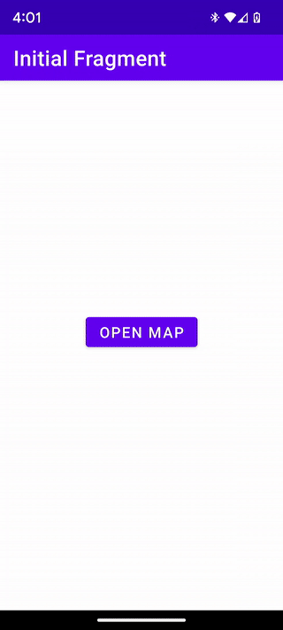

[](https://discord.gg/X8QB9DJXX6)

<!--
// TODO - enable when the repo gets released and is public

-->

[](https://github.com/openmobilehub/omh-maps/actions/workflows/publish_maps_api.yml)
[](https://github.com/openmobilehub/omh-maps/actions/workflows/publish_maps_api_gms.yml)
[](https://github.com/openmobilehub/omh-maps/actions/workflows/publish_maps_api_ngms.yml)


# OMH Maps Client Library

## Overview
OMH Maps Client Library is an Android SDK that simplifies the integration of maps on both Google Mobile Services (GMS) and non-GMS devices. It provides a unified interface and components for a consistent map experience, eliminating the need for separate codebases for different Android builds. This repository contains a detailed Getting Started guide to help developers learn and effectively implement the OMH Maps Client Library into their Android projects. For a general overview and understanding of the philosophy behind OMH, please visit the official website at https://www.openmobilehub.com.

## A single codebase, running seamlessly on any device
For instance, the following screenshots showcase multiple devices with Android, both with GMS and Non-GMS. The same app works without changing a single line of code, supporting multiple map provider implementations (Google Maps and OpenStreetMap).
<div align="center">

| Non-GMS</br>Kindle Fire HD 10 Kids | Non-GMS</br>Pixel 6 Pro | Non-GMS Device</br>Huawei P60     | GMS</br>Pixel 6a |
| ----------------------- | --------------------- | ----------- | ------------ |
|   |  |  |        |

</div>

# Getting started
This section describes how to setup an Android Studio project to use the OMH Maps SDK for Android. For greater ease, a base code will be used within the repository. 

**Note: To quickly run a full-featured app with all OMH Maps functionality, refer to the [`Sample App`](#sample-app) section and follow the provided steps.**
   
## Set up the development environment
1. Android Studio is required. If you haven't already done so, [download](https://developer.android.com/studio/index.html) and [install](https://developer.android.com/studio/install.html?pkg=studio) it.
2. Ensure that you are using the [Android Gradle plugin](https://developer.android.com/studio/releases/gradle-plugin) version 7.0 or later in Android Studio.

## Clone the repository
To clone the repository and checkout the `starter-code` branch, use the following command in your Terminal:

   ```
   git clone --branch starter-code https://github.com/openmobilehub/omh-maps.git
   ```

## Set up your Google Cloud project for applications with Google Services(Google Maps)
Complete the required Cloud Console setup following the next steps, for more information see [Documentation](https://developers.google.com/maps/documentation/android-sdk/cloud-setup)

### Steps

#### Set up your project
1. In the Google Maps Cloud Console, on the project selector page, click **Create Project** to begin creating a new Cloud project, [Go to the project selector page](https://console.cloud.google.com/projectselector2/home/dashboard?utm_source=Docs_ProjectSelector&_gl=1*1ylhfe0*_ga*MTUwMDIzODY1Ni4xNjc1OTYyMDgw*_ga_NRWSTWS78N*MTY4MjA4ODIyNS44NS4xLjE2ODIwODgyMzcuMC4wLjA.). 
2. Make sure that billing is enabled for your Cloud project, [Confirm that billing is enabled for your project](https://console.cloud.google.com/project/_/billing?_gl=1*msea12*_ga*MTUwMDIzODY1Ni4xNjc1OTYyMDgw*_ga_NRWSTWS78N*MTY4MjA4ODIyNS44NS4xLjE2ODIwODgyMzcuMC4wLjA.). 

#### Enable APIs
1. To use Google Maps Platform, you must enable the APIs or SDKs you plan to use with your project, [Enable the Maps SDK for Android](https://console.cloud.google.com/apis/library/maps-android-backend.googleapis.com?utm_source=Docs_EnableSpecificAPI&_gl=1*t8hu9m*_ga*MTUwMDIzODY1Ni4xNjc1OTYyMDgw*_ga_NRWSTWS78N*MTY4MjA4ODIyNS44NS4xLjE2ODIwODgyMzcuMC4wLjA.).

#### Get an API Key
1. This step only goes through the API Key creation process. If you use your API Key in production, we strongly recommend that you restrict your API key. You can find more information in the product-specific Using API Keys page.
2. The API key is a unique identifier that authenticates requests associated with your project for usage and billing purposes. You must have at least one API key associated with your project.
3. Go to the **Google Maps Platform > Credentials** page, [Go to the Credentials page](https://console.cloud.google.com/project/_/google/maps-apis/credentials?utm_source=Docs_Credentials&_gl=1*9zgq7y*_ga*MTUwMDIzODY1Ni4xNjc1OTYyMDgw*_ga_NRWSTWS78N*MTY4MjA4ODIyNS44NS4xLjE2ODIwODgyMzcuMC4wLjA.).
4. On the **Credentials** page, click **Create credentials > API key**. The **API key created** dialog displays your newly created API key.
5. Click **Close**. The new API key is listed on the **Credentials** page under **API keys**. (Remember to [restrict the API](https://developers.google.com/maps/api-security-best-practices#restricting-api-keys) key before using it in production.)

**Note:** To continue it is necessary to complete the creation of an API key. If you had problems please visit [Set up your Google Cloud project](https://developers.google.com/maps/documentation/android-sdk/cloud-setup).

## Add the API key to your app
You should not check your API key into your version control system, so it is recommended
storing it in the `local.properties` file, which is located in the root directory of your project.
For more information about the `local.properties` file, see [Gradle properties files](https://developer.android.com/studio/build#properties-files).

1. Open the `local.properties` in the project level directory, and then add the following code. Replace `YOUR_API_KEY` with your API key.

   ```
   MAPS_API_KEY=YOUR_API_KEY
   ```

2. Save the file.
3. In your `maps-starter-sample` module level `AndroidManifest.xml`file, under the `application` element add the `meta-data` element as follows:

   ```xml
   <manifest ...>
      <application ...>
         ...
         <meta-data
            android:name="com.google.android.geo.API_KEY"
            android:value="${MAPS_API_KEY}" />
      </application>
   </manifest>
   ```

4. In your "maps-starter-sample" module-level `AndroidManifest.xml` add the required permissions, for more information see [permissions](https://developer.android.com/training/permissions/declaring).

   ```xml
   <manifest ...>
      <uses-permission android:name="android.permission.ACCESS_COARSE_LOCATION" />
      <uses-permission android:name="android.permission.ACCESS_FINE_LOCATION" />
      <uses-permission android:name="android.permission.INTERNET" />
      <uses-permission android:name="android.permission.ACCESS_NETWORK_STATE" />
      <application ...>
         ...
      </application>
   </manifest>
   ```

## Gradle configuration
To integrate the OMH Maps into your project, it is necessary to add a few Gradle dependencies.

### Add OMH Core plugin
To incorporate OMH Maps into your project, you have two options: utilize the OMH Core Plugin or directly include the OMH Client libraries dependencies. The subsequent instructions will outline the necessary steps for including the OMH Core Plugin as a Gradle dependency.

1. In your `maps-starter-sample" module-level `build.gradle` under the `plugins` element add the plugin id.

   ```kotlin
   plugins {
      ...
      id("com.openmobilehub.android.omh-core")
   }
   ```

2. Save the file and [sync Project with Gradle Files](https://developer.android.com/studio/build#sync-files).

### Configure the OMH Core plugin
In this sample app, we utilize the `omhConfig` definition to expand the capabilities of the existing Android Studio variants. For more details, refer to the [OMH Core Plugin Docs](https://github.com/openmobilehub/omh-core/tree/release/1.0).

   #### Basic configuration
   
   1. In your `maps-starter-sample` module-level `build.gradle` file add the following code at the end of the file.

   ```kotlin
   ...
   dependencies {
      ...
   }

   omhConfig {
      bundle("singleBuild") {
         maps {
            gmsService {
               dependency = "com.openmobilehub.android:maps-api-googlemaps:1.0"
            }
            nonGmsService {
               dependency = "com.openmobilehub.android:maps-api-openstreetmap:1.0"
            }
         }
      }
      bundle("gms") {
         maps {
            gmsService {
               dependency = "com.openmobilehub.android:maps-api-googlemaps:1.0"
            }
         }
      }
      bundle("nonGms") {
         maps {
            nonGmsService {
               dependency = "com.openmobilehub.android:maps-api-openstreetmap:1.0"
            }
         }
      }
   }
   ```

   In this step, you defined the OMH Core Plugin bundles to generate multiple build variants with specific suffixes as their names. For example, if your project has `release` and `debug` variants with `singleBuild`, `gms`, and `nonGms` OMH bundles, the following build variants will be generated:

   - `releaseSingleBuild`, `releaseGms`, and `releaseNonGms`
   - `debugSingleBuild`, `debugGms`, and `debugNonGms`
   
   ##### Variant singleBuild
   - Define the `Service`. In this example is maps.
   - Define the `ServiceDetails`. In this example are `gmsService` and `nonGmsService`.
   - Define the dependency and the path. In this example are `com.openmobilehub.android:maps-api-googlemaps:1.0"` and `com.openmobilehub.android:maps-api-openstreetmap:1.0`.
   
      **Note: It's important to observe how a single build encompasses both GMS and Non-GMS configurations.**

   ##### Variant gms
   - Define the `Service`. In this example is maps.
   - Define the `ServiceDetails` . In this example is `gmsService`.
   - Define the dependency and the path. In this example is `com.openmobilehub.android:maps-api-googlemaps:1.0"`.
   
      **Note:** gms build covers only GMS (Google Mobile Services).

   ##### Variant nonGms
   - Define the `Service`. In this example is maps.
   - Define the `ServiceDetails` . In this example is `nonGmsService`.
   - Define the dependency and the path. In this example is `com.openmobilehub.android:maps-api-openstreetmap:1.0`.
   
      **Note:** nonGms build covers only Non-GMS configurations.
   
2. Save and [sync Project with Gradle Files](https://developer.android.com/studio/build#sync-files). 
3. Now you can select a build variant. To change the build variant Android Studio uses, do one of the following:
   - Select `Build` > `Select Build Variant...` in the menu.
   - Select `View` > `Tool Windows` > `Build Variants` in the menu.
   - Click the `Build Variants` tab on the tool window bar.

4. You can select any of the 3 variants for the `:Maps-starter-sample`:
   - `singleBuild` variant builds for GMS (Google Mobile Services) and Non-GMS devices without changes to the code.(Recommended)
   - `gms` variant  builds for devices that has GMS (Google Mobile Services).
   - `nonGms` variant builds for devices that doesn't have GMS (Google Mobile Services).

   **Note:** In the rest of this guide, we will use the `debugSingleBuild` variant to demonstrate the same build running on GMS and Non-GMS devices.

5. Open `maps-starter-sample` module-level `MainApplication` class and add the required imports below the package name. The file is in the same level as the `MainActivity`:

   ```kotlin
   import com.omh.android.maps.api.factories.OmhMapProvider
   ```

   Then initialize the `OmhMapProvider` as follows:

   ```kotlin
    class MainApplication : Application() {
   
        override fun onCreate() {
            super.onCreate()
            
        OmhMapProvider.Initiator()
            .addGmsPath(BuildConfig.MAPS_GMS_PATH)
            .addNonGmsPath(BuildConfig.MAPS_NON_GMS_PATH)
            .initialize()
        }
    }
   ```

   **Important:** If you encounter the error "Missing BuildConfig.MAPS_GMS_PATH and BuildConfig.MAPS_NON_GMS_PATH in BuildConfig class". Follow the next steps:
   - [Sync Project with Gradle Files](https://developer.android.com/studio/build#sync-files). 
   - Select `Build` from the menu at the top in Android Studio. 
   - Click on `Clean Project` and await. 
   - Click on `Rebuild Project` and await.

## Add the map into your app
The main interfaces that you will be interacting with are called `OmhMap`, `OmhMapView` and `OmhLocation`.
It contains all your basic maps and location functions like displaying a marker, map gestures, getting current location and more.
Additionally a fragment `OmhMapFragment` is provided, this fragment manages the life cycle of the map.

### Add a Map fragment
`OmhMapFragment` is the simplest way to place a map in an application.
Fragment has to declare `android:name` that sets the class name of the fragment to `OmhMapFragment`, which is the fragment type used in the maps fragment file.

1. Insert the XML fragment snippet into the `fragment_map.xml`.

```xml
...
    <fragment
        android:id="@+id/fragment_map_container"
        android:name="com.omh.android.maps.api.presentation.fragments.OmhMapFragment"
        android:layout_width="0dp"
        android:layout_height="0dp"
        app:layout_constraintBottom_toBottomOf="parent"
        app:layout_constraintEnd_toEndOf="parent"
        app:layout_constraintStart_toStartOf="parent"
        app:layout_constraintTop_toTopOf="parent" />
...
```

And the complete fragment's layout should look similar to this example:

```xml
<?xml version="1.0" encoding="utf-8"?>
<androidx.constraintlayout.widget.ConstraintLayout xmlns:android="http://schemas.android.com/apk/res/android"
    xmlns:app="http://schemas.android.com/apk/res-auto"
    xmlns:tools="http://schemas.android.com/tools"
    android:layout_width="match_parent"
    android:layout_height="match_parent"
    tools:context=".MapFragment">

   <fragment
           android:id="@+id/fragment_map_container"
           android:name="com.omh.android.maps.api.presentation.fragments.OmhMapFragment"
           android:layout_width="0dp"
           android:layout_height="0dp"
           app:layout_constraintBottom_toBottomOf="parent"
           app:layout_constraintEnd_toEndOf="parent"
           app:layout_constraintStart_toStartOf="parent"
           app:layout_constraintTop_toTopOf="parent" />

</androidx.constraintlayout.widget.ConstraintLayout>
```

2. Change the variant to `debugSingleBuild`.
3. Click `Run` for the `maps-starter-sample`.

### Display your current location
An `OmhMap` must be acquired using `getMapAsync(OmhOnMapReadyCallback)`. This class automatically initializes the maps system and the view.

1. Implement the `OmhOnMapReadyCallback` interface and override the `onMapReady()` method, to set up the map when the `OmhMap` object is available:

   ```kotlin
    import android.Manifest.permission.ACCESS_COARSE_LOCATION
    import android.Manifest.permission.ACCESS_FINE_LOCATION
    import android.content.pm.PackageManager
    import android.os.Bundle
    import android.util.Log
    import androidx.fragment.app.Fragment
    import android.view.LayoutInflater
    import android.view.View
    import android.view.ViewGroup
    import androidx.activity.result.contract.ActivityResultContracts
    import androidx.core.content.ContextCompat
    import com.omh.android.maps.api.factories.OmhMapProvider
    import com.omh.android.maps.api.presentation.fragments.OmhMapFragment
    import com.omh.android.maps.api.presentation.interfaces.location.OmhFailureListener
    import com.omh.android.maps.api.presentation.interfaces.location.OmhSuccessListener
    import com.omh.android.maps.api.presentation.interfaces.maps.OmhMap
    import com.omh.android.maps.api.presentation.interfaces.maps.OmhOnMapReadyCallback
    import com.omh.android.maps.api.presentation.models.OmhMarkerOptions
    import com.omh.android.maps.starter_sample.databinding.FragmentMapBinding

    class MapFragment : Fragment(), OmhOnMapReadyCallback {
   
        // ...
   
        override fun onMapReady(omhMap: OmhMap) {
            if (!hasPermissions()) {
                Log.e("permission error", "Not required permissions to get current location")
                return
            }
        
            val onSuccessListener = OmhSuccessListener { omhCoordinate ->
                omhMap.moveCamera(omhCoordinate, 15f)
                val omhMarkerOptions = OmhMarkerOptions().apply { 
                    title = "My Current Location"
                    position = omhCoordinate 
                }
                omhMap.addMarker(omhMarkerOptions)
            }
            val onFailureListener = OmhFailureListener { exception ->
                Log.e("location error", exception.localizedMessage, exception)
            }
            // Safe use of 'noinspection MissingPermission' since it is checking permissions in the if condition
            // noinspection MissingPermission
            OmhMapProvider.getInstance().provideOmhLocation(requireContext()).getCurrentLocation(onSuccessListener, onFailureListener)
        }
    
        private fun hasPermissions() = arrayOf(ACCESS_FINE_LOCATION, ACCESS_COARSE_LOCATION).all {
            ContextCompat.checkSelfPermission(requireContext(), it) == PackageManager.PERMISSION_GRANTED
        }
    }
   ```

2. In your fragment's onViewCreated(view: View, savedInstanceState: Bundle?) method, get the `OmhMapFragment` by calling FragmentManager.findFragmentById(). 
Then use `getMapAsync()` to register for the map callback:

   ```kotlin
    override fun onViewCreated(view: View, savedInstanceState: Bundle?) {
        super.onViewCreated(view, savedInstanceState)

        // Request permissions, this can be done in another way, see https://developer.android.com/training/permissions/requesting
        registerForActivityResult(ActivityResultContracts.RequestMultiplePermissions()) {
            // Obtain the OmhMapFragment and get notified when the map is ready to be used.
            val omhMapFragment = childFragmentManager.findFragmentById(R.id.fragment_map_container) as? OmhMapFragment
            omhMapFragment?.getMapAsync(this)
        }.launch(arrayOf(ACCESS_FINE_LOCATION, ACCESS_COARSE_LOCATION))
    }
   ```

3. Click `Run` for the `maps-starter-sample` menu option (or the play button icon) to run your app and see the map with the device's location.

   **Important: For a better experience and accuracy try a phone with a SIM card.**

4. Explore Advanced Features
   
   Complete the guide and access advanced mapping features: camera events, markers, location management, gestures, network utilities, and custom implementations/plugins. Visit [Advanced Features](https://github.com/openmobilehub/omh-maps/wiki#ohm-map-sdk---advanced-features) for details, examples, and        guides. Enhance your mapping experiences. Explore now!

# Sample App
This repository includes a [maps-sample](/maps-sample) that demonstrates the functionality of the OMH Maps Client Library. By cloning the repo and executing the app, you can explore the various features offered by the library. However, if you prefer a step-by-step approach to learn the SDK from scratch, we recommend following the detailed Getting Started guide provided in this repository. The guide will walk you through the implementation process and help you integrate the OMH Maps Client Library into your projects effectively.

# Documentation
* Find complete documentation on the [Wiki](https://github.com/openmobilehub/omh-maps/wiki).
* Check out the [API Reference Docs](https://openmobilehub.github.io/omh-maps).

# Provider Implementations / Plugins
OMH Maps SDK is open-source, promoting community collaboration and plugin support from other map providers to enhance capabilities and expand supported map services. More details can be found at https://github.com/openmobilehub/omh-maps/wiki.

# Contributing
Please contribute! We will gladly review any pull requests. Make sure to read the [Contributing](https://github.com/openmobilehub/omh-maps/blob/release/1.0/CONTRIBUTING.md) page first though.

# License
```
Copyright 2023 Open Mobile Hub
 
Licensed under the Apache License, Version 2.0 (the "License");
you may not use this file except in compliance with the License.
You may obtain a copy of the License at

    https://www.apache.org/licenses/LICENSE-2.0

Unless required by applicable law or agreed to in writing, software
distributed under the License is distributed on an "AS IS" BASIS,
WITHOUT WARRANTIES OR CONDITIONS OF ANY KIND, either express or implied.
See the License for the specific language governing permissions and
limitations under the License.
```
